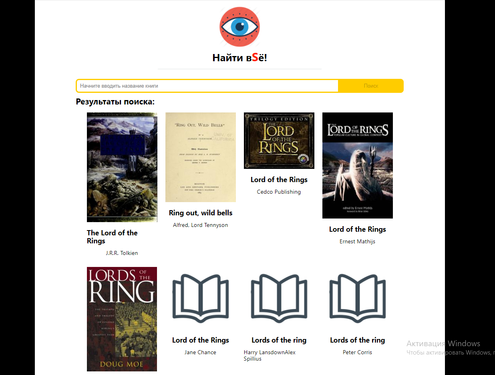

# Проект: Search-books

## Тестовое задание:  Стажер – разработчик фронтенда в Яндекс.Недвижимость 


## Описание:

Поисковик книг с адаптивной версткой.

Приложение состоит из поисковой строки, куда вводится название книги, рядом  кнопка поиска. Под строкой поиска выводится список сниппетов найденных книг, состоящих из изображения с обложкой, названия книги, автора. При клике на сниппет книги в модальном окне выводится более подробная информация: увеличенное изображение с обложкой, название книги, автор, дата публикации, издатель, ISBN книги.





### Ссылка на проект: https://alex76456.github.io/search-books/


### Установка

Клонируйте себе в репозиторий, затем:

```
npm install
```
```
npm run start
```

**Используемые технологии:**
* React
* flexbox;
* grid layout;
* javasript;
* относительные величины;
* относительное и абсолютное позиционировани;


*Планы по доработке*:  
*  Исправить баг поиска( при автопоиске, ищет по предпоследнему состоянию)

